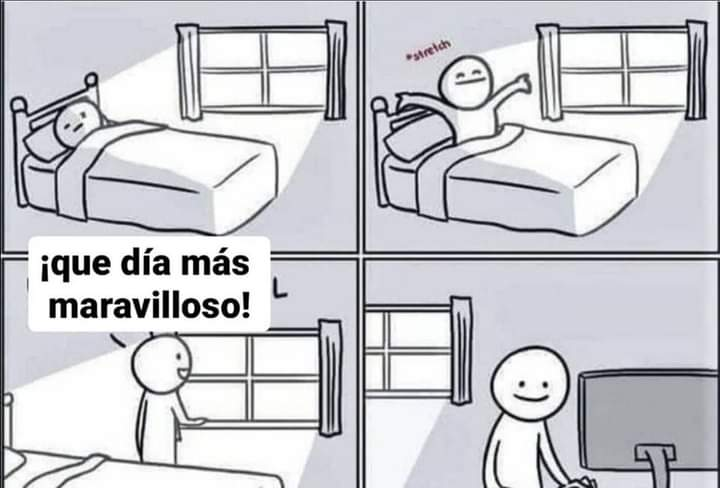

# Diario de Y2

## Tengo cosas que decir...pero en secreto
En mis ratos de silencio me encuentro conmigo mismo hablando de cosas muy interesantes que sin embargo, olvido al instante.

Y eso es un problema porque me olvido de conclusiones muy ricas en sabiduria que podría solucionar muchas cosas de mi vida.

Ahora mismo estaba pensando si era mejor escribir en papel o crear un archivo digital donde desahogarme...y bueno aqui estoy.

Ahora hay algo que me preocupa y es el hecho de que tengo un dolor en el pecho que viene y va sin aparente razón, y eso me angustia y hace que el dolor aumente mucho mas.

Tambien el hecho de que tenga cosas de decir y que cuando estoy frente a mi diario se me olviden y no diga nada.

Pero bueno, el punto de este archivo es lograr sacar todo tipo de sensaciones y emociones intensas que necesite sacar, y supongo que con un diario al alcance de mi mobil pueda ser de utilidad.

## Tanto que hacer y no hago nada
### Fecha: 18 de Septiembre 2022

No encontré la imagen mas adecuada pero lo que pasa es lo siguiente.  
Tengo un finde semana totalmente libre, mi compañero de habitacion se ha ido a su tierra y tengo 4 paredes totalmente libre...pero tengo la sensacion de que no estoy haciendo nada.  
La cosa es que tengo tantas cosas en mi mente que hacer que hago varias cosas en el dia, pero a medias, y eso me genera la sensacion de no completar nada de lo que tengo en mi lista.
Por ejemplo ayer en la mañana una vez libres de formacion estube ocupado esperando a que me llamarán ( porque me toco ser voluntario para tareas militares) y perdi el tiempo hasta las 11am llenando el espacio con memes y facebook etc.  
Despues de eso:
-  me puse a ver youtube, actualizandome en las noticias ( ucrania, programacion). 
- escuchar my preciada dream pop ( the marias, the do ) y relajarme encima del colchon recostado sin moverme.  
- Luego escuche un podcast del señor santo que estubo interesante 
- algo del filosofo Darin Mcnabb.  
- Me cree un diario digital ( esta :D) y escribí un poco.  
- Chatee muy poco con la familia pero bueno al menos lo hice
- Converso con los compañeros en las horas de comida o cuando toca salir.
- Compro dos camisetas de diario con Taylor que de paso me sirvio para compartir ciertas anecdotas de mi arrivo a España

muchas cosas verdad ?, pues mi sensacion es que no complete nada importante. Me gustaría haber llamado al medico para que den una cita para traumotologia y un psicologo.  
Leer mas libros, John Cleese, filosofia o una novela, y es que hay tanto que leer !!  
Tratar de encontrar solución al problema del dolor del pecho de una vez.  

Tal vez la cosa va en que debo centrarme en completar las cosas que ahora mismo considero importante y despues completar el resto...pero que tan importante considero leer filosofia por ejemplo ? que es algo que me incomoda no haberlo hecho.

Organizemos ideas. Lo mas importante ahora para mi es:
- Borrar el dolor del pecho o conocer su verdadera causa, visitar a un psicologo y desahogarme ( o encontrar a alguien con quien desahogarme que es mas economico...pero no sabe de causas)
- mejorar mi nivel de hablar
- relajarme

mmm...con relajarme a que me puedo estar refiriendo? escuchando musica me relaja un monton. Jugar videojuegos tambien aunque debo admitir que gta5 no me divierte tanto. Aprovechar que tengo un ordenador potente para hacer cosas, nose diseñar mi pagina web o jugar algo o yo que se.

> En fin, estoy confundido en que debo priorizar. Usar mi tiempo de fin de semana para completar tareas, o simplemente relajarme y ya veremos que pasa despues.

## Awareness sobre el ser Humano 
Estoy dándome cuenta de que el ser humano es muy imperfecto, o al menos los compañeros milicos que tengo aquí cada uno tiene su imperfección y su rareza que hace que nos demos cuenta lo mortal y carnosos que somos. 
El sierra, Alonso, Álvaro, Olmedo, garrido, fer, luisfer, Miguel... 
Personajes completos con su rareza particular. 

## Sobre la soledad en Zaragoza 
Cuando desperté al día siguiente de la noche de discoteca con los guardias reales, me dio un rezacon, y con esto la depresión. 
Y por ende mis pensamientos eran los típicos que suelo tener en esos casos, el sin sentido de la vida, lo poco que valemos, no importa lo que haga, etc. Pero hubo una que hacía tener ganas de llorar, mi soledad. Mientras caminaba por Zaragoza por el borde del río me tope con familias paseando y gente agrupada pasándola bien. Cuando me encontré con un grupo de ecuatorianos jugando volley se me lleno la mente de recuerdos y el corazón se debilitó. La sensación de soledad es desagradable, te sientes aislado y sin motivos de vivir. Extrañe de pronto a mi padre y me sentí mal por dejarlo ahí solo, sentía pena de perderme de las historias con el gato y la mami deisy y el resto. 
Me sentí abandonado por todos.
Siento que necesito a una mujer, una novia con quien pueda pasar el rato y que sea un apoyo emocional para estos casos tan dolorosos. Que bonito fuera tener una maña que me enseñe su cultura y al mismo tiempo me de lo que necesito, compañía y una persona permanente en mi vida que pueda confíar. 

## El dolor de la amenaza
Cada vez que me amenazan o sucede algo alrededor mío en el que puede peligrar mi vida por más mínimo que sea mi cuerpo y mi mente cambian a un estado de alerta y me duele. Pero es un dolor psicológico, de mente, una sensación hermana de la desesperación osea del mismo tipo de sensación que la desesperación. No sé si tiene nombre o no pero no me gusta estar así, alerta y ansioso esperando que acabe ya. 

## Mi lindo Ecuador
Al escuchar a verde70 volví a momentos en Ecuador lo que me hizo tener sensaciones antiguas. Hoy coincidí con las pestañas de la película de julio jaramillo y me conmovió su música, su acento y su historia, ahora podría decir con mucha seguridad que estoy enamorado de mi país Ecuador, su manera de contar sus historias al mundo,  su forma  amoldada por siglos que da un toque único a nosotros los ecuatorianos y la manera en que nos hizo vivir la niñez y  juventud. Cuando veo una película española o americana no me puedo identificar con sus relatos pues no  representan nada q he vivido, en cambio una película ecuatoriana si, su entorno, personajes, habla me hacen sentirme representado. La sensación de haber vivido parte de la película es muy placentero, pocas cosas pueden invocar este manjar de emociones. 
No se porque pero al ver Alba me recordaba a la Eli, la seriedad de la niña y como hablaba y comportaba y las amigas que tenia, todo. También me hacía reflexionar del hecho de que me gusta un tipo de chica que haya pasado por malos ratos para yo poder ayudarla a salir a la superficie del océano de represión social. 

## Incómodo en casa todavía 
La paso bien sólo cuando estoy en la casa de mi padre en Barcelona, el día empieza por las 10 una vez que haya dormido mis merecidas 8horas, hago ejercicio, la baño y me visto. Desayuno lo que me aparece en el momento ( leche con chocolates :) ) y empiezo a hacer cositas. 
Me gusta estar en el ordenador mucho tiempo porque ahí puedo ver mi series o vídeos de interés o jugar videojuegos o aprender algo o leer, recordar, cantar, etc. 

En esta temporada por ejemplo me estoy viendo adventure time, Rick y morty, y animando un gift para mi página web. 

Se llegar a un punto de agobio de estar en esas cuatro paredes pero es solo cuando estoy varios días sin salir. 
Lo verdaderamente incómodo de estar en la casa es estar con mi padre, no lo soporto, me parece una persona con unas ideas y moral anticuadas y de mal gusto. Y no es lo peor, su actitud es horrible hasta tal punto que ya no puedo controlar mis propios sentimientos y emociones cuando estoy junto a él. Me pongo ansioso y me agobio, nose donde mirar y trato de evitar todo tipo de conversa con el, porque no me gustan sus respuestas autoritarias y artificiales. 

Y claro ahora todo eso que pienso de él es lo q me have sentir mucho peor, pues siendo mi padre el que me ha dado todo en esta vida, no le estoy agradeciendo con mi trato. 

Por lo que esa casa ahora mismo está maldita, apenas topo su suelo con un pie me invade una sensación espiritual desagradable. 

Creo que esto se puede curar diciéndole todo esto a mi padre y encararlo para po fin poder liberarme y ya ser tal y como soy y no encerrarme en esta actitud neutral no emocional que me toca adoptar con el ( soy otra persona dentro, me transformó para evitar hacer daño a alguien). Pero eso no va a pasar hasta q sepa que alguien va a estar a su lado cuando se lo diga. 

## Papel de soldado
Ya intérprete mi papel de soldado con mi familia. En Navidad me fui a casa de mi tío yury, tomamos y comimos un montón, y en ese tiempo pude interpretar un papel que en las anteriores navidades no sabía si siquiera lo iba a hacer. Es bonito y enriquecedor saber que has cumplido una meta, aunque no me parece la gran cosa, si que es algo que no todo el mundo puede realizarlo. 
En fin, hablé de como es ser un soldado, que armas uso, que cosas hago, rango, compañeros, forma de vida, etc. Me sentí bien. Aparte fue la primera Navidad en la que estoy trabajando de manera permanente en una empresa, con un sueldo estable y ya di mis primeros regalos de Navidad con mi dinero ( aunque podría discutir si en realidad hice algo para merecerlo). 
Ya me estoy convirtiendo, poco a poco, en un adulto, ya no soy el niño de las fiestas y ya estoy apunto de abandonar el papel de adolescente de la fiesta. 
Y viendo en los demás, me ha ido bien, porque por ejemplo la Nao no ha podido todavía encontrar una carrera q en realidad le guste y tampoco un trabajo, lo que hace q no sea independiente todavía algo que se ve que ya quiere. 
Solo agradezco a todos los que se han topado en mi camino y me han hecho tener un sistema de ideas q me haya conducido por un camino de decisiones  hasta aquí, un lugar que me agrada ( siempre y cuando no se encienda una guerra) 

## Abstinencias
El alcohol tiene q salir de mi vida, no lo veo bueno en ningun sentido ya...bueno en solo uno, que me hace sentir cómodo en una reunión familiar ( algo que en si mismo es malo), pero claro dudo mucho que sea la mejor y única solución. 

Por lo que he decidido de manera oficial y  seria dejar el alcohol. Cuando vaya a una fiesta tomaré literalmente solo una para animar mi alma social, pero de ahí nada más, no vale la pena. 

Las cosas que hago cuando tomo demasiado son muy vergonzosas para mi y siempre que despierto al día siguiente me da miedo cuando alguien me dice riéndose de las cosas que hice ayer sin acordarme de nada. En algún momento haré una pataneria injustificable y me verán mal, y aparte se que tengo problemas sentimentales que pueden explotar en esos momentos. 

Quiero aprender a disfrutar de mi gente sobrio, y alguien q me da ese ejemplo es iago que disfruta mucho más que todos los borrachos de una disco juntos. 

Es un cambio de perspectiva sobre la diversión en las fiestas, no es la bebida la que te libera y te hace ser terriblemente social, eso es parte de ti, no puede ser otra persona el q o hace, hay que aprender a sacarlo, tal y como sacas tu niño interior en el momento que te colocas la nariz en el clown. 

Porque mi único motivo para beber es conectar con la gente en una fiesta, poder conversar de todo cómodamente sin vergüenzas ni miedos. 
Hay personas q sus motivos son más complejas de esquivar, como la depresión, o el vicio. 

## La pos-guerra del aislamiento eada
Después de pasar 3senanas desconectado del mundo completamente atrapado en una zona de servicios escasos con el objetivo de endurecer a los que entran a la EADA, me siento raro.
Ahora que tengo la opción de escoger que hacer, no se que hacer. Veo mis tareas pendientes y me parecen extrañas, entro a las redes sociales y no les encuentro el sentido. Por el momento lo único que si me da ganas hacer es escuchar un Podcast o a mi McNabb o una serie.
La cosa es que estar durante mucho tiempo viviendo solo para seguir órdenes,  hacer nada más que vigilar tus cosas y comer y prepararte para castigos y puteos, te altera un poco la forma de vivir el día a día. Ya no tienes aspiraciones  solo sobrevivir el día.
Ahora me disgusta em hecho de que tendré q repetir esta exlriencka unas cuantas veces más y que me faltan dos meses para terminar con todo esto. Me pregunto como se sentirá me gente que no puede escapar de estas situaciones. 